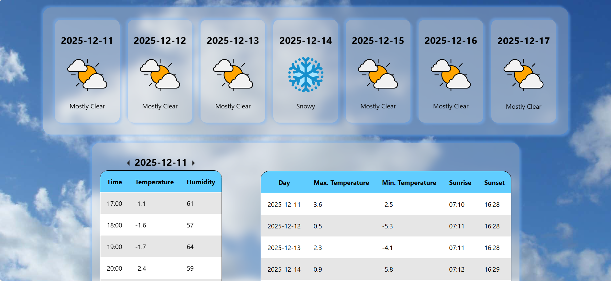
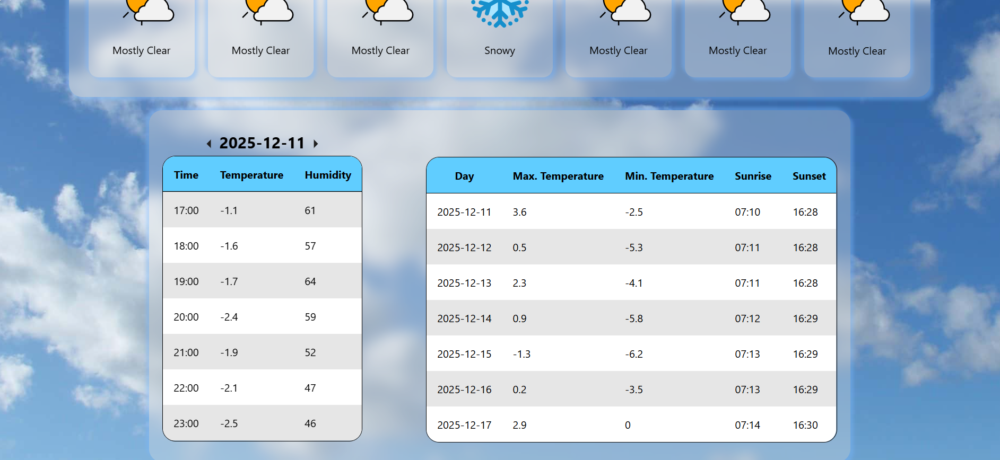

# My Weather API Project
## The purpose of this project
I made this project to showcase my full-stack website development skills, despite not covering other concepts like CRUD and databases, while I have these skills already. Therefore, this only shows some aspects of web development I am capable of using in projects like these.

## My skills
### My skills in technical terms
This project exhibits my programming skills in the web development field, where I can work with:
* React in the frontend (client side)
* Express in the backend (server side)
* Responsive web designing
* API calls and fetching data

### My skills in non-technical terms

I can build the server side and client side aspects of a website. This means I know how to style a website, how to structure it, how to make it responsive, and how to connect it to the server running logic such as retrieving data.

## How to see what I've built

Just run this command in the target directory:  
```
git clone https://github.com/Abdur-RahmanIslam2010/Weather-API-Portfolio-Project
cd server && npm install && node server.js
cd client && npm install && npm start

```

## Previews

Here's what the website looks like:  



API Link: [https://open-meteo.com/en/docs](https://open-meteo.com/en/docs)